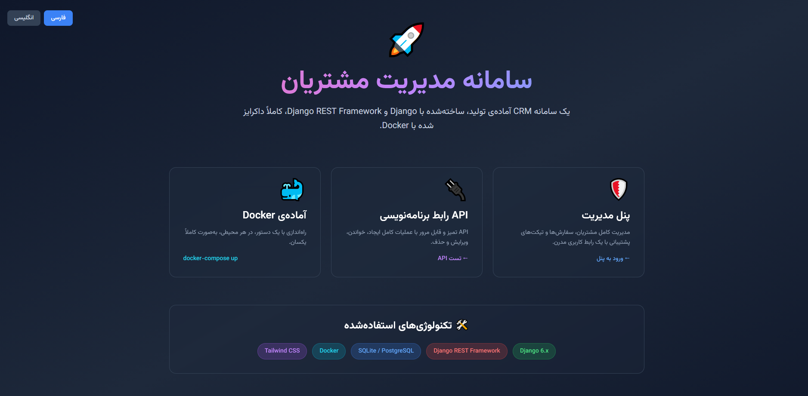
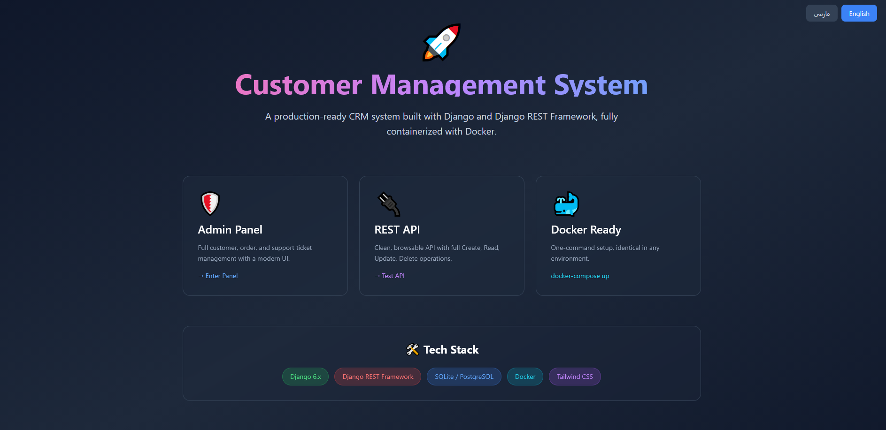
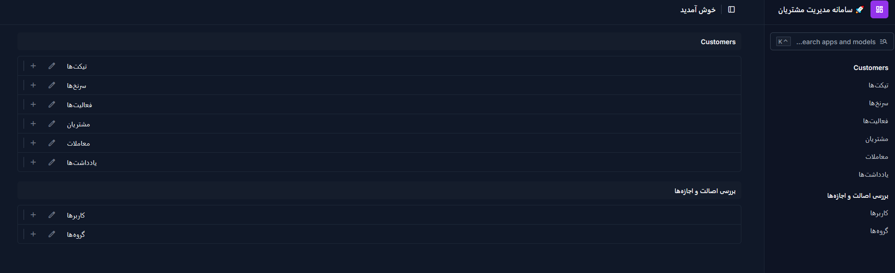
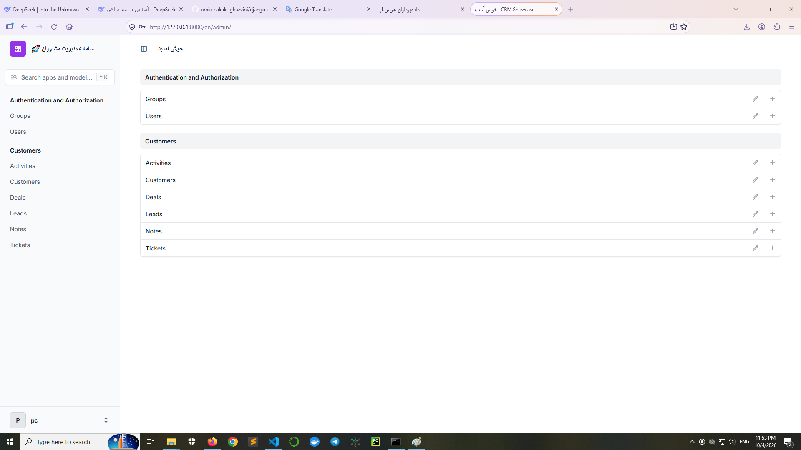

# 🚀 Django CRM Showcase

> A bilingual (Persian/English) production-ready CRM system built with Django, Django REST Framework, and modern admin interface.

[](https://www.djangoproject.com/)
[](https://www.django-rest-framework.org/)
[](https://www.python.org/)
[](https://www.docker.com/)
[](LICENSE)

---

## 📖 Overview

**Django CRM Showcase** is a full-featured Customer Relationship Management system designed to demonstrate enterprise-grade architecture, bilingual support (Persian/English), and modern Django practices.

This project showcases:
- 🎯 **Complete CRM data model** — Customers, Leads, Deals, Tickets, Notes, Activities
- 🌐 **Full i18n support** — Persian (RTL) and English (LTR) with automatic direction switching
- 🎨 **Modern admin interface** — Powered by [Django Unfold](https://github.com/unfoldadmin/django-unfold)
- 🔌 **RESTful API** — Built with Django REST Framework
- 🐳 **Docker-ready** — One-command setup
- 🧪 **Tested** — Comprehensive test coverage

---

## 📸 Screenshots

### 🏠 Home Page

<table>
  <tr>
    <td width="50%">
      <strong>🇮🇷 Persian (RTL)</strong><br>
      
    </td>
    <td width="50%">
      <strong>🇬🇧 English (LTR)</strong><br>
      
    </td>
  </tr>
</table>

### 🛡️ Admin Panel

<table>
  <tr>
    <td width="50%">
      <strong>🇮🇷 Persian (RTL)</strong><br>
      
    </td>
    <td width="50%">
      <strong>🇬🇧 English (LTR)</strong><br>
      
    </td>
  </tr>
</table>

---

## ✨ Features

### 🎯 Core CRM Models

| Model | Description |
|-------|-------------|
| **Customer** | Full customer profile with status (Active/Inactive/VIP), contact info, and company details |
| **Lead** | Pre-customer prospects with source tracking (Website, Referral, Social, etc.) and status pipeline |
| **Deal** | Sales opportunities with amount, stage, probability, and expected close date |
| **Ticket** | Support tickets with priority levels (Low/Medium/High/Urgent) and resolution tracking |
| **Note** | Attachable notes for customers, leads, and deals |
| **Activity** | Activity log (Calls, Emails, Meetings, Tasks) with due dates |

### 🌐 Bilingual Support

- **Full i18n** with Django's native translation system
- **Automatic RTL/LTR** switching based on active language
- **URL-based language routing** (`/fa/` and `/en/`)
- **Translation files** for models, admin, and API
- **Persian font** (Vazirmatn) automatically loaded for RTL pages

### 🎨 Modern Admin Panel

- Powered by **Django Unfold** — a modern Tailwind-based admin theme
- Custom color scheme and branding
- Organized fieldsets with collapsible sections
- Advanced filtering and search
- Autocomplete for related fields
- Date hierarchy navigation

### 🔌 REST API

- **Browsable API** with DRF's interactive interface
- Full CRUD endpoints for Customer
- Pagination support
- Clean, documented endpoints

---

## 🛠️ Tech Stack

| Category | Technology |
|----------|-----------|
| **Backend** | Django 6.x, Django REST Framework |
| **Database** | SQLite (dev) / PostgreSQL (production-ready) |
| **Admin UI** | Django Unfold + Tailwind CSS |
| **i18n** | Django i18n + gettext |
| **Fonts** | Vazirmatn (Persian) |
| **Containerization** | Docker, Docker Compose |

---

## 🚀 Quick Start

### Prerequisites

- Python 3.10+
- pip
- Git

### Installation

```bash
# Clone the repository
git clone https://github.com/omid-sakaki-ghazvini/django-crm-showcase.git
cd django-crm-showcase

# Create and activate virtual environment
python -m venv venv

# Windows
venv\Scripts\activate
# Linux/Mac
source venv/bin/activate

# Install dependencies
pip install -r requirements.txt

# Run migrations
python manage.py migrate

# Create superuser
python manage.py createsuperuser

# (Optional) Compile translations
python manage.py compilemessages

# Run the development server
python manage.py runserver
```

### Access the application

| URL | Description |
|-----|-------------|
| `http://127.0.0.1:8000/fa/` | Home page (Persian) |
| `http://127.0.0.1:8000/en/` | Home page (English) |
| `http://127.0.0.1:8000/fa/admin/` | Admin panel (Persian) |
| `http://127.0.0.1:8000/en/admin/` | Admin panel (English) |
| `http://127.0.0.1:8000/api/customers/` | REST API |

---

## 📁 Project Structure

```
django-crm-showcase/
├── config/                      # Project configuration
│   ├── settings.py             # Settings (bilingual, DRF, Unfold)
│   ├── urls.py                 # URL routing with i18n
│   └── wsgi.py
├── customers/                   # Main CRM application
│   ├── migrations/             # Database migrations
│   ├── templates/
│   │   └── home.html           # Bilingual home page
│   ├── admin.py                # Admin configuration
│   ├── models.py               # CRM models
│   ├── serializers.py          # DRF serializers
│   ├── views.py                # Views & API endpoints
│   └── urls.py
├── locale/                      # Translation files
│   └── en/LC_MESSAGES/
│       └── django.po           # English translations
├── screenshots/                 # Project screenshots
├── requirements.txt
├── manage.py
└── README.md
```

---

## 🌍 Translation

To add or update translations:

```bash
# Extract translatable strings
python manage.py makemessages -l en --ignore=venv --ignore=tools

# Edit locale/en/LC_MESSAGES/django.po

# Compile translations
python manage.py compilemessages
```

---

## 🤝 Contributing

Contributions are welcome! Feel free to:

1. Fork the project
2. Create a feature branch (`git checkout -b feature/amazing-feature`)
3. Commit your changes (`git commit -m 'feat: add amazing feature'`)
4. Push to the branch (`git push origin feature/amazing-feature`)
5. Open a Pull Request

---

## 📄 License

This project is licensed under the MIT License — see the [LICENSE](LICENSE) file for details.

---

## 👨‍💻 Author

**Omid Sakaki Ghazvini**

- 🎯 AI Architect | Senior Machine Learning Engineer | AI Team Lead
- 🏢 Full-stack AI Engineer at Iran's Technical and Vocational Training Organization
- 🎓 AI Instructor at University of Tehran, University of Applied Science and Technology
- 🚀 Founder @ AI Tech Home
- 🔗 GitHub: [@omid-sakaki-ghazvini](https://github.com/omid-sakaki-ghazvini)

---

## ⭐ Show your support

If this project helped you, please give it a ⭐️!

---

<p align="center">
  Built with ❤️ using Django & Django REST Framework
</p>
